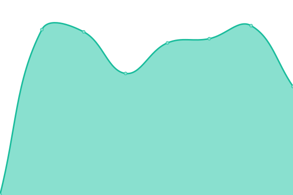

# [📈 Live Status](https://upptime.github.io/upptime): <!--live status--> **🟩 All systems operational**

This repository contains the open-source uptime monitor and status page for [Upptime](https://upptime.js.org), powered by [Upptime](https://github.com/upptime/upptime).

<!--start: status pages-->
<!-- This summary is generated by Upptime (https://github.com/upptime/upptime) -->
<!-- Do not edit this manually, your changes will be overwritten -->
<!-- prettier-ignore -->
| URL | Status | History | Response Time | Uptime |
| --- | ------ | ------- | ------------- | ------ |
|  [Visulry Health Check](https://visulry.com/health) | 🟩 Up | [visulry-health-check.yml](https://github.com/shipcommit/upptime/commits/HEAD/history/visulry-health-check.yml) | 

 399ms
     
 | 

<a href="https://shipcommit.github.io/upptime/history/visulry-health-check">100.00%</a>
    

|  [Visulry Articles Data](https://visulry.com/articles/__data.json) | 🟩 Up | [visulry-articles-data.yml](https://github.com/shipcommit/upptime/commits/HEAD/history/visulry-articles-data.yml) | 

 387ms
     
 | 

<a href="https://shipcommit.github.io/upptime/history/visulry-articles-data">100.00%</a>
    

|  [Captorify Readiness](https://captorify.com/readyz) | 🟩 Up | [captorify-readiness.yml](https://github.com/shipcommit/upptime/commits/HEAD/history/captorify-readiness.yml) | 

 581ms
     
 | 

<a href="https://shipcommit.github.io/upptime/history/captorify-readiness">100.00%</a>
    

|  [Captorify Site](https://captorify.com/) | 🟩 Up | [captorify-site.yml](https://github.com/shipcommit/upptime/commits/HEAD/history/captorify-site.yml) | 

 635ms
     
 | 

<a href="https://shipcommit.github.io/upptime/history/captorify-site">100.00%</a>
    

<!--end: status pages-->

[**Visit our status website →**](https://shipcommit.github.io/upptime/)

## 📄 License

- Powered by: [Upptime](https://github.com/upptime/upptime)
- Code: [MIT](./LICENSE) © [Anand Chowdhary](https://anandchowdhary.com), supported by [Pabio](https://pabio.com)
- Data in the `./history` directory: [Open Database License](https://opendatacommons.org/licenses/odbl/1-0/)
